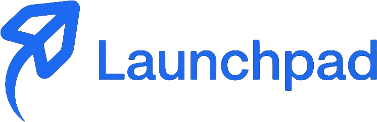

<div align="center">
  

  <h3>Your job search has a lot of moving pieces. LaunchPad gives them one home.</h3>

  <p>
    Track applications, remember every follow-up, prepare stronger interview stories,
    and keep your next opportunity moving forward.
  </p>
</div>

## Welcome to LaunchPad

LaunchPad is a private career workspace for students, early-career candidates, and anyone who wants a calmer way to manage a job search. It brings applications, deadlines, interviews, notes, documents, goals, and career accomplishments together without turning the process into another full-time job.

This repository contains the independent, self-hosted version of LaunchPad. It runs on infrastructure you control and does not depend on Emergent services.

## What you can do

- **See your whole search at a glance.** Use the dashboard, application list, and Kanban board to understand what is moving and what needs attention.
- **Stay ahead of important dates.** Keep events, interviews, and follow-ups in one calendar, with optional export to a dedicated Google Calendar.
- **Build momentum.** Set a daily or weekly application goal and watch your progress update as applications are added.
- **Remember your strongest work.** Save skills, experiences, projects, accomplishments, and interview notes in the Career Library.
- **Keep the details nearby.** Add notes, compensation information, reminders, resumes, and job descriptions to each application.
- **Spend less time typing.** Import and export CSV files, capture event flyers, read structured job pages, and optionally improve extracted details with Gemini.
- **Add things while you browse.** The companion Chrome extension supports application capture, quick events, persistent drafts, and a compact weekly calendar.

## A quick look at the experience

| Area | What it helps with |
| --- | --- |
| Dashboard | Progress, goals, upcoming interviews, follow-ups, and key application numbers |
| Applications | Searchable records, details, notes, attachments, CSV import, and CSV export |
| Board | A visual pipeline from Applied through Offer or Rejected |
| Calendar | Events, interviews, follow-ups, reminders, flyer capture, and optional Google sync |
| Career Library | Reusable skills, experience, projects, accomplishments, and top strengths |
| Settings | Profile, preferences, connected services, sessions, data export, and account deletion |
| Extension | Fast application and event capture without leaving the page you are viewing |

## Start locally

You only need Docker Desktop, or another Docker installation with Compose support.

```bash
docker compose up --build
```

Open [http://localhost:8080](http://localhost:8080), choose **Sign up**, and create your account. The database starts empty, and your data remains in Docker volumes when the containers stop.

```bash
docker compose down
```

To customize local settings, copy `.env.example` to `.env` before starting. Keep `.env` private and never commit it.

### What runs locally

- React frontend served by Caddy
- FastAPI backend
- MongoDB for accounts and private user data
- MinIO for resume and job-description attachments

Only the web application is exposed to your computer at `127.0.0.1:8080`. The database, object storage, and backend stay on the private Compose network.

Check the running stack at any time:

```bash
./scripts/healthcheck.sh
```

The health endpoint is also available at [http://localhost:8080/api/health](http://localhost:8080/api/health).

## Privacy by design

LaunchPad is built around a simple rule: one user should never see another user's career data.

- Every application, event, Career Library record, note, attachment, calendar connection, and analytics request is scoped to the authenticated user.
- Requests for another user's record return the same `404` response as a record that does not exist.
- Session tokens are stored in an HTTP-only cookie, and only one-way hashes are stored in MongoDB.
- Google credentials are encrypted, never returned to the browser, and used only for the connection the user chose to create.
- The Google Calendar integration manages a separate calendar named **LaunchPad** and does not import unrelated personal calendars.
- Uploaded flyer and job screenshots are processed as drafts and are not saved automatically.

MongoDB does not call this row-level security, but the API applies the equivalent ownership boundary to every private operation.

## Chrome extension

The unpacked extension lives in `extension/` and currently points to the local app at `http://localhost:8080`.

1. Open `chrome://extensions`.
2. Turn on **Developer mode**.
3. Choose **Load unpacked** and select the `extension/` directory.
4. Sign in from the popup, or reuse the website session from the same Chrome profile.

Version 1.8.0 includes persistent application and event drafts, shared Simple/Advanced application fields, no-AI page grabbing, structured `JobPosting` reading, cropped screenshot capture, optional AI improvement, a weekly event view, and a direct Settings shortcut.

The ready-to-download local archive is available at `frontend/public/launchpad-extension.zip`.

Before publishing the extension, replace the localhost URL, restrict backend CORS to the final extension ID, review the requested permissions, and rebuild the archive.

## Optional AI assistance

Local flyer extraction remains available without an AI account. When a flyer or job posting is difficult to read, **Improve with AI** can send only the selected image and limited OCR text—or the limited job-page text the user explicitly chose to read—to Gemini Flash-Lite.

The AI request:

- never runs automatically;
- returns an editable draft rather than saving anything;
- leaves the local draft intact if the provider fails; and
- is protected by a per-user daily limit.

Add `GEMINI_API_KEY` to `.env` and recreate the backend to enable it. `GEMINI_MODEL` can override the configured model, and `AI_FLYER_DAILY_LIMIT` controls the daily cost guardrail.

## Google sign-in

Google sign-in uses an OAuth web client owned by the LaunchPad operator. It requests only `openid`, `email`, and `profile`, and it links accounts only when Google provides the same verified email address.

For local development:

1. Configure the OAuth consent screen in Google Cloud.
2. Create an OAuth 2.0 client with application type **Web application**.
3. Add this exact redirect URI:

```text
http://localhost:8080/api/auth/google/callback
```

4. Set `GOOGLE_CLIENT_ID`, `GOOGLE_CLIENT_SECRET`, and `PUBLIC_BASE_URL=http://localhost:8080` in `.env`.
5. Recreate the backend:

```bash
docker compose up --build -d backend
```

The Google button stays hidden when credentials are absent. While the consent screen is in testing mode, remember to add each permitted Google account as a test user.

## Optional Google Calendar export

LaunchPad always saves events locally first. Calendar access is requested only when a user clicks **Connect Google Calendar**.

1. Enable the Google Calendar API in the same Google Cloud project.
2. Add this second redirect URI:

```text
http://localhost:8080/api/integrations/google-calendar/callback
```

3. Add permitted accounts as consent-screen test users.
4. Generate and save a token-encryption key as `GOOGLE_CALENDAR_TOKEN_KEY`:

```bash
openssl rand -base64 32 | tr '+/' '-_'
```

5. Recreate the backend with `docker compose up --build -d backend`.

Do not rotate or lose this key while connections exist. Disconnecting removes LaunchPad's encrypted credential but intentionally leaves the dedicated calendar and its events in the connected Google account.

## Optional demo data

The default database is empty. If you want a sample account with ten historical applications, add this to your local `.env`:

```dotenv
SEED_DEMO_DATA=true
DEMO_EMAIL=local-demo@example.test
DEMO_PASSWORD=choose-a-local-password
```

Never enable the demo account in a public deployment.

## Backups and restores

Create a local snapshot of MongoDB and stored attachments:

```bash
./scripts/backup.sh
```

Backups are written beneath `backups/`, include checksums, and are ignored by Git.

A restore replaces the current database and attachment bucket. Stop using the app while it runs and provide the explicit confirmation flag:

```bash
./scripts/restore.sh --yes backups/20260908T120000Z
```

## Invite-only production beta

The production configuration is intentionally conservative. It uses HTTPS, secure cookies, exact host and CORS allowlists, Google-only new accounts, an email allowlist, authenticated MongoDB, a private S3-compatible attachment bucket, rate limits, free-tier quotas, structured logs, and disabled API documentation.

Before inviting anyone:

1. Point your domain to a Linux server with Docker Compose.
2. Provision a private S3-compatible bucket and a credential limited to that bucket.
3. Copy `.env.production.example` to `.env.production` and replace every placeholder.
4. Add invited addresses to `BETA_ALLOWED_EMAILS` and to the Google consent screen's test users.
5. Add the production login and Calendar callback URLs to the Google OAuth client.
6. Generate the MongoDB replica-set key file described in the environment example.
7. Verify storage access:

```bash
./scripts/test-production-storage-config.sh
```

8. Start the production stack:

```bash
docker compose \
  --env-file .env.production \
  -f compose.yaml \
  -f compose.production.yaml \
  up --build -d
```

Caddy obtains and renews TLS certificates automatically. Production does not start the local MinIO service; it requires the pre-provisioned private bucket.

### Production backups and monitoring

Configure the `rclone` remote named by `BACKUP_REMOTE`, then create an encrypted off-server backup:

```bash
./scripts/backup-production.sh
```

Daily backups retain seven daily and four weekly snapshots. Complete a clean restore before inviting users:

```bash
./scripts/restore-production.sh --yes backups/production/launchpad-TIMESTAMP.tar.gz.enc
```

The `ops/` directory contains systemd templates for daily backups and five-minute production checks. Configure an independent uptime monitor for `https://YOUR_DOMAIN/api/health` and set `ALERT_WEBHOOK_URL` if you want operational failures delivered to a compatible webhook.

Read the [production-readiness checklist](docs/production-readiness.md), [storage security assessment](docs/storage-security-assessment.md), and [clean-server beta drill](docs/clean-server-beta-drill.md) before launch. A single MongoDB replica-set member enables transactional writes but is not high availability and does not replace off-server backups.

## Development and verification

Backend variables are documented in `backend/.env.example`; frontend variables are in `frontend/.env.example`. The production frontend calls the API through same-origin `/api`.

The continuous-integration workflow runs:

- 81 backend tests against an isolated Docker Compose stack;
- 22 frontend tests;
- the production frontend build;
- extension JavaScript, manifest, DOM-reference, structured `JobPosting`, and archive checks.

Local data lives in these named volumes:

- `launchpad_mongo_data`
- `launchpad_minio_data`

`docker compose down` keeps them. `docker compose down --volumes` permanently deletes the local database and attachments.

## Project status

LaunchPad is preparing for a small, invite-only beta. The web experience is the first release target; the Chrome extension will follow after production packaging and store review.

If you are trying LaunchPad, thank you. Job searching can be uncertain and exhausting—the goal of this project is to make the practical parts feel a little more organized, a little more visible, and a lot less lonely.
